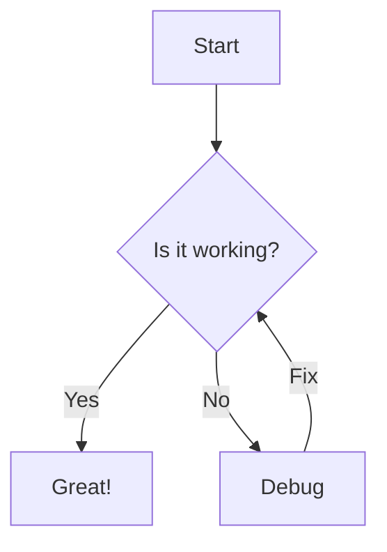
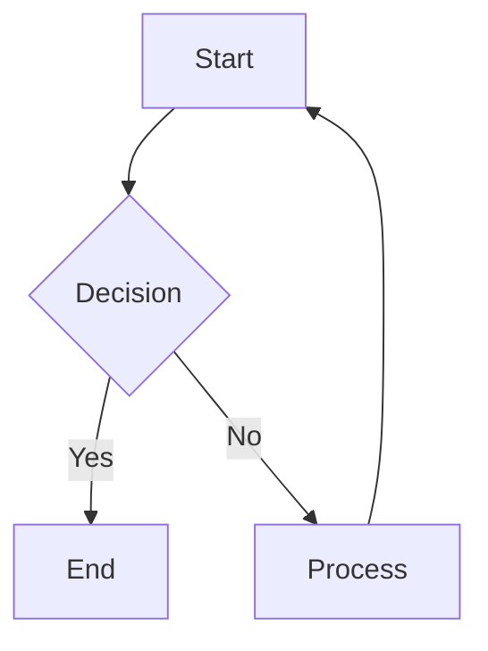

# Message Renderer

<div align="center">
  


[](https://www.npmjs.com/package/@openagent-cloud/message-renderer)
[](https://opensource.org/licenses/MIT)
[](https://www.typescriptlang.org/)
[](https://bundlephobia.com/package/@openagent-cloud/message-renderer)

**A powerful React component for rich markdown rendering with interactive elements**

[Live Demo](https://openagent-cloud-message-renderer.vercel.app/) | [Documentation](#features) | [Examples](#framework-integration) | [Troubleshooting](#troubleshooting)

</div>

A powerful React component for rendering rich markdown content with support for:

- ✨ Syntax highlighted code blocks (200+ languages)
- 🔧 Editable code blocks with Monaco editor
- 📊 Mermaid diagrams (flowcharts, sequence diagrams, etc.)
- 🧮 LaTeX math equations (inline and block)
- 📺 Media embeds (YouTube, audio, video, 3D models, text files)
- 📝 GitHub-flavored markdown
- 🎨 Dark mode support
- 🔄 Auto-updating content
- 🌐 URL detection and automatic embedding

## 🚀 Installation

```bash
npm install @openagent-cloud/message-renderer
```

## 🏁 Quick Start

````tsx
import { MessageRenderer } from '@openagent-cloud/message-renderer'
import 'katex/dist/katex.min.css' // Required for math rendering

function MyComponent() {
  const markdown = `
# Hello World

This is a **Markdown** example with a [link](https://example.com).

```javascript
// Code with syntax highlighting
function greet(name) {
  return \`Hello, \${name}!\`
}
````



## 🌟 What Makes This Different?

Unlike most markdown renderers, this library:

1. **Handles Complex Media** - Automatically detects and renders various media types from URLs
2. **Interactive Code Blocks** - Supports editable code with full IDE-like experience
3. **Recursive Content Parsing** - Properly handles nested content structures
4. **Rich Diagrams** - Renders Mermaid diagrams with proper styling and integration
5. **Math Rendering** - Full LaTeX support via KaTeX
6. **Dark Mode Support** - Works seamlessly with light and dark themes
7. **URL Intelligence** - Automatically recognizes and renders different URL types appropriately

<details>
<summary><strong>See all the differences in detail</strong></summary>

| Feature                  | Message Renderer                    | Other Markdown Libraries           |
| ------------------------ | ----------------------------------- | ---------------------------------- |
| Media embedding          | ✅ Automatic from URLs              | ❌ or limited                      |
| Editable code blocks     | ✅ With Monaco Editor               | ❌ Static only                     |
| Mermaid diagrams         | ✅ battle-tested integration        | ⚠️ Often breaks in React           |
| Math rendering           | ✅ Full KaTeX support               | ⚠️ Often requires extra config     |
| Content parsing          | ✅ Recursive for complex structures | ⚠️ Often mishandles nested content |
| GitHub Flavored Markdown | ✅ Full support                     | ✅ Usually supported               |
| Dark mode                | ✅ Built-in support                 | ⚠️ Often requires manual styling   |
| Type safety              | ✅ Full TypeScript support          | ⚠️ Often limited                   |

</details>

## ⚙️ Props

| Prop           | Type    | Default  | Description                                  |
| -------------- | ------- | -------- | -------------------------------------------- |
| `content`      | string  | Required | Markdown content to render                   |
| `showExamples` | boolean | false    | Show demo examples of all supported features |

## 📚 Features

### Code Blocks

Regular and editable code blocks with syntax highlighting:

````tsx
// Regular code block
```typescript
function example() {
  return "hello"
}
````

// Editable code block

```javascript
// [editable]
function example() {
  return 'hello'
}
```

```

### Mermaid Diagrams

Create diagrams with Mermaid syntax:

```



```

### Media Embeds

Simply place a URL on its own line (with blank lines before and after):

```

Check out this video:

https://www.youtube.com/watch?v=dQw4w9WgXcQ

And listen to this audio:

https://example.com/audio.mp3

````

## 🔧 Framework Integration

### Next.js App Router

```tsx
// app/components/ContentRenderer.tsx
'use client'

import { MessageRenderer } from '@openagent-cloud/message-renderer'
import 'katex/dist/katex.min.css'

export default function ContentRenderer({ content }: { content: string }) {
  return <MessageRenderer content={content} />
}
````

### Next.js Pages Router

```tsx
// pages/content/[id].tsx
import { MessageRenderer } from '@openagent-cloud/message-renderer'
import 'katex/dist/katex.min.css'

export default function ContentPage({ content }) {
  return (
    <div className="container mx-auto py-8">
      <MessageRenderer content={content} />
    </div>
  )
}
```

### React + Vite

```tsx
// src/App.tsx
import { useState } from 'react'
import { MessageRenderer } from '@openagent-cloud/message-renderer'
import 'katex/dist/katex.min.css'

function App() {
  const [markdown, setMarkdown] = useState('# Hello\n\nStart typing markdown here...')

  return (
    <div className="container mx-auto p-4">
      <div className="grid grid-cols-2 gap-4">
        <textarea
          value={markdown}
          onChange={(e) => setMarkdown(e.target.value)}
          className="p-2 border rounded h-[500px]"
        />
        <div className="border rounded p-4">
          <MessageRenderer content={markdown} />
        </div>
      </div>
    </div>
  )
}
```

## 🧩 Advanced Usage

For more specific use cases, you can import individual components:

```tsx
import {
  MermaidComponent,
  YouTubeEmbed,
  AudioPlayer,
  VideoPlayer,
  TextFileViewer,
} from '@openagent-cloud/message-renderer'

// Use components directly
function Example() {
  return (
    <div>
      <MermaidComponent chart="graph TD; A-->B; B-->C;" />
      <YouTubeEmbed videoId="dQw4w9WgXcQ" />
    </div>
  )
}
```

## 🎨 CSS Setup

### Tailwind CSS

Include the component paths in your `tailwind.config.js`:

```js
/** @type {import('tailwindcss').Config} */
module.exports = {
  content: [
    './src/**/*.{js,ts,jsx,tsx}',
    './node_modules/@openagent-cloud/message-renderer/dist/**/*.{js,ts,jsx,tsx}',
  ],
  theme: {
    extend: {},
  },
  plugins: [
    require('@tailwindcss/typography'), // For better markdown styling
  ],
}
```

### Manual CSS Import

```jsx
// In your main application file
import '@openagent-cloud/message-renderer/dist/style.css'
```

## 🔍 Troubleshooting

### Common Issues

**Media not embedding properly**

- Make sure URLs are on their own line with blank lines before and after
- Check browser console for CORS issues with external media

**Mermaid diagrams not rendering**

- Verify your Mermaid syntax is correct
- Try adding a few blank lines before and after the Mermaid code block

**Dark mode issues**

- Ensure your app has either `dark` class on some parent element or uses CSS variables

**Monaco editor not loading**

- Make sure you're not using SSR for this component without proper client-side hydration

### Performance Tips

- Use dynamic imports for heavy content pages
- Consider lazy-loading the component for route-based applications
- If rendering many instances, implement virtualization

## 🌐 Browser Compatibility

- Chrome: ✅ Full support
- Firefox: ✅ Full support
- Safari: ✅ Full support
- Edge: ✅ Full support
- IE: ❌ Not supported

## 📝 Contributing

We welcome contributions! Please feel free to submit a Pull Request.

## 📄 License

MIT
